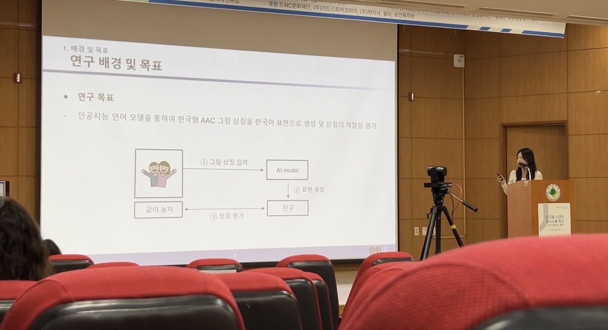

# ChatGPTwithAAC-ai
2024 한국형보완대체의사소통상징의 GPT-4o 기반 평가

# 한국형 보완대체의사소통(AAC) 상징의 GPT-4o 기반 평가

> **2024 한국보완대체의사소통학회 추계학술대회** 발표 (2024.12.14) 
> 지원: 한국연구재단 NRF-2021S1A3A2A01096102

---

## 📌 연구 개요

한국형 AAC(Augmentative and Alternative Communication) 그림 상징 약 **10,000개**에 대해 GPT-4o 멀티모달 모델을 활용하여 상징 표현의 적절성을 자동으로 평가한 연구입니다.

기존에는 사람 전문가가 직접 검증하던 AAC 상징의 적절성을 AI 언어 모델이 얼마나 유사하게 인식하는지를 측정하고, 향후 LLM 기반 검증 파이프라인 도입 가능성을 탐색했습니다.

---

## 🔍 배경 및 목표

- AAC 상징 체계집은 약 **만 개의 상징**으로 구성되며, 다양한 장애 유형의 사용자를 고려한 어휘 기반 그림 상징으로 이루어져 있음
- 기존 상징 검증은 **다수의 사람 전문가**를 통해 수행되었으나, AI 모델의 인식 결과와의 비교 연구는 부재
- GPT-4o가 그림 상징을 입력받아 생성한 한국어 표현이 전문가 검증 표현과 얼마나 일치하는지를 정량적으로 측정

---

## ⚙️ 실험 파이프라인

```
AAC 이미지 + 기존 표현
        ↓
[1] 프롬프트 엔지니어링 (GPT-4o)
        → 상징에 대한 한국어 표현 1~3순위 생성
        ↓
[2] 데이터 전처리 (Data Cleansing)
        → 맞춤법 교정, 특수문자 처리, 띄어쓰기 검사, 마스킹 문자 통일
        ↓
[3] 유사도 측정 (KR-SBERT + Cosine Similarity)
        → 기존 표현 벡터 vs GPT-4o 생성 표현 벡터 간 유사도 계산
        → 1~3순위 중 최댓값 저장
```

---

## 🛠️ 기술 스택

| 분류 | 내용 |
|------|------|
| AI 모델 | GPT-4o (Multimodal LLM) |
| 임베딩 | KR-SBERT (`snunlp/KR-SBERT-V40K-klueNLI-augSTS`) |
| 유사도 측정 | Cosine Similarity (Bi-Encoder 구조) |
| 언어/환경 | Python, Google Colab (GPU: T4) |
| 주요 라이브러리 | `openai`, `sentence-transformers`, `transformers`, `pandas`, `sklearn` |

---

## 📁 코드 구조

```
📦 ChatGPTwithAAC-ai/
├── 보완대체의사소통_학회_발표자료.pdf   ← 학회 발표 슬라이드
├── README.md
└── 📁 src/
    ├── prompt_engineering.ipynb        ← GPT-4o API 호출 및 프롬프트 설계
    ├── similarity.ipynb                ← KR-SBERT 기반 유사도 계산 (최적화 버전)
    └── sentencebert_similarity.ipynb   ← Sentence-BERT 유사도 계산 (초기 버전)
```

### 파일별 역할

**`prompt_engineering.ipynb`**
- AAC 그림 상징 이미지를 Base64로 인코딩하여 GPT-4o API에 전달
- System 프롬프트로 한국어 상징 해석 역할 부여
- 그림 상징 1개당 연상 표현 3개(1~3순위) 생성
- `temperature=0.3` 설정으로 창의성보다 정확성 우선

**`similarity.ipynb`**
- KR-SBERT로 생성 표현과 기존 표현을 각각 임베딩
- 배치 인코딩(`batch_size=32`)으로 전체 데이터 효율 처리
- 기존 표현(1~4개 의미) 각각과의 코사인 유사도 중 최댓값 저장

**`sentencebert_similarity.ipynb`**
- `sentence_transformers`의 `util.pytorch_cos_sim` 활용
- 1~3순위 생성 표현별 유사도를 개별 컬럼(`sentence1Similarity` 등)으로 저장

---

## 📊 실험 결과

| 유사도 범위 | 상징 수 | 비율 |
|------------|--------|------|
| 50% 이상 | 4,333개 | 73.4% |
| 40% 이상 50% 미만 | 251개 | 4.2% |
| 30% 이상 40% 미만 | 405개 | 6.9% |
| 20% 이상 30% 미만 | 415개 | 7.0% |
| 20% 미만 | 502개 | 8.5% |
| **총합** | **5,906개** | **100%** |

→ 전체 상징의 **73.4%**에서 GPT-4o 인식 결과와 전문가 표현이 50% 이상 일치

---

## 💡 결론 및 향후 연구

- AAC 상징 검증에 GPT-4o 기반 자동화 평가 파이프라인을 적용할 수 있음을 확인
- 유사도 20% 미만 상징(502개)은 상징 재설계 필요성 시사
- 향후 한국형 AAC 상징 확장 시, 전문가 검증과 LLM 기반 검증을 병행하는 방식 제안

---

## ⚠️ 주의사항

- 코드 내 OpenAI API 키는 `.env` 파일 또는 환경변수로 관리해야 합니다.
- 본 저장소에는 실험에 사용된 원본 데이터셋(AAC 이미지, CSV)은 포함되지 않습니다.

---


**본인 담당 파트:**
- 데이터 전처리 (맞춤법 교정, 특수문자 처리, 띄어쓰기 검사)
- GPT-4o 프롬프트 엔지니어링 설계 및 구현
- KR-SBERT 기반 유사도 측정 파이프라인 구현


## 📌 연구 개요




[📄 학회 발표자료 보기](./2024_보완대체의사소통_학회_발표자료.pdf)
